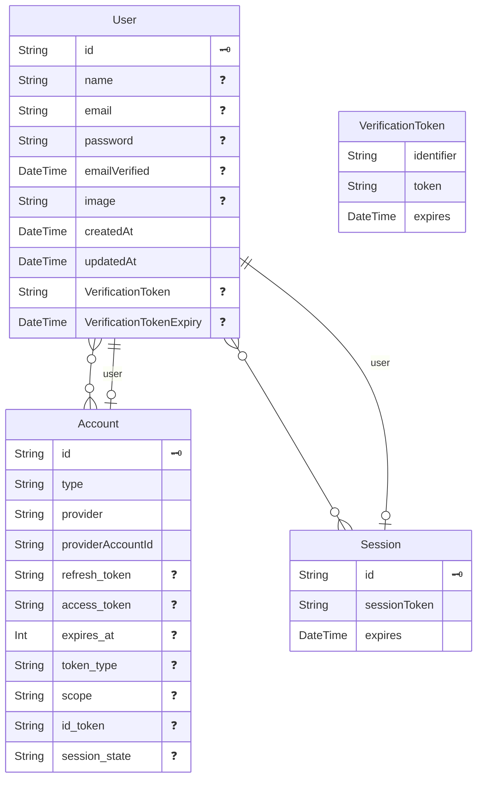

```mermaid
erDiagram

  "User" {
    String id "🗝️"
    String name "❓"
    String email "❓"
    String password "❓"
    DateTime emailVerified "❓"
    String image "❓"
    DateTime createdAt 
    DateTime updatedAt 
    String VerificationToken "❓"
    DateTime VerificationTokenExpiry "❓"
    }
  

  "Account" {
    String id "🗝️"
    String type 
    String provider 
    String providerAccountId 
    String refresh_token "❓"
    String access_token "❓"
    Int expires_at "❓"
    String token_type "❓"
    String scope "❓"
    String id_token "❓"
    String session_state "❓"
    }
  

  "Session" {
    String id "🗝️"
    String sessionToken 
    DateTime expires 
    }
  

  "VerificationToken" {
    String identifier 
    String token 
    DateTime expires 
    }
  
    "User" o{--}o "Account" : ""
    "User" o{--}o "Session" : ""
    "Account" o|--|| "User" : "user"
    "Session" o|--|| "User" : "user"
```
